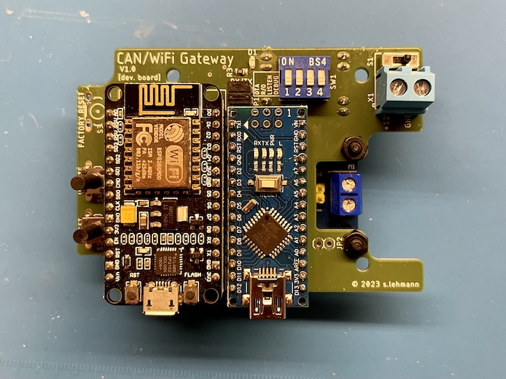

# CAN/WiFi Gateway Hardware
Schematics and PCB layout for a CAN-WiFi gateway based on an ESP8266, an Arduino Nano and a CAN adapter/bridge.

Currently, there is only the DevBoard version available, which was designed to replace a prototype based on prototyping boards, some wires and a case. The dev board is meant to provide a more robust and reliable base for attaching and connecting the individual off-the-shelf components together:

 * An ESP8266 dev board ("NodeMCU Lolin V2")
 * An Arduino Nano V3
 * A CAN bus module based on MCP2515/TJA1050 with SPI (e.g. https://amzn.eu/d/gYvjiQy)
 * A power supply module (e.g. https://amzn.eu/d/45afEuz)

The shape and mounting hole pattern is designed to fit into an casing made for possibly moist/wet environments (https://sonoff.tech/product/accessories/ip66/), which is available from different vendors.

The (bare) PCBs can be directly ordered at https://aisler.net/simon-lehmann/can-wifi-gateway/can-wifi-gw-devboard. Of course, any other manufacturer can be used too.

This can be used for running https://github.com/simonlmn/can-wifi-gateway-stiebel-eltron to provide an HTTP-based API to a Stiebel Eltron heat pump.

<nobr></nobr>

## Support

If you want to support this project, you can:

 * use it and provide feedback
 * provide additional variations or versions (e.g. support for ESP32 or a fully integrated board)
 * 

## Bill of Materials

Listed below are all components needed to fully assemble the DevBoard and mounting it in a fitting casing.

The listed prices are based on average prices from retailers (Germany), but sometimes only available when purchasing in "larger" quantities (e.g. a pack of five instead of just one). Most components can be interchanged for compatible variants from different manufacturers. The prices were last checked mid 2023.

### Electronic parts

| Part                                                                            | Quantity | Unit Price | Total Price |
| :------------------------------------------------------------------------------ | -------: | ---------: | ----------: |
| NodeMCU V2 (ESP8266/ESP-12F)                                                    |        1 |     5.00 € |      5.00 € |
| Arduino Nano V3 (ATmega328P)                                                    |        1 |     6.50 € |      6.50 € |
| MCP2515-based CAN Bus Shield                                                    |        1 |     6.50 € |      6.50 € |
| MP1584EN-based DC-DC Buck Converter 4.5-28V to 0.8-20V                          |        1 |     1.00 € |      1.00 € |
| 74LVC1T45GW Bus Transceiver, TSSOP-6                                            |        3 |     0.35 € |      1.05 € |
| PPTC-Fuse FSMD050-1210-R, 16 V, 500 mA                                          |        1 |     0.50 € |      0.50 € |
| 100 nF Capacitor, SMD 1206                                                      |        6 |     0.05 € |      0.30 € |
| 1 kOhm Resistor, SMD 0805                                                       |        1 |     0.05 € |      0.05 € |
| LED Yellow, SMD 0805                                                            |        1 |     0.10 € |      0.10 € |
| DIP-Switch, 4 Position, 2.54 mm, Through Hole                                   |        1 |     0.50 € |      0.50 € |
| Tactile Switch, 6 x 6 mm, 10 mm Stem Height, Through Hole                       |        3 |     0.10 € |      0.30 € |
| Sliding Switch, SPDT, 3-pin, Vertical, Through Hole                             |        1 |     0.20 € |      0.20 € |
| 2-pole Terminal Block, Screw Type, Horizontal, 5.08 mm, Through Hole            |        1 |     0.65 € |      0.65 € |
| 1x15-Pin Header, Female, 8.5 mm Socket Height, 2.54 mm, Through Hole            |        4 |     0.50 € |      2.00 € |
| 1x7-pin Header, Female, 8.5 mm Socket Height, 2.54 mm, Through Hole             |        1 |     0.30 € |      0.30 € |
| 1x2-Pin Header, Female, 8.5 mm Socket Height, 2.54 mm, Through Hole             |        5 |     0.15 € |      0.75 € |
| 1x2-Pin Header, Male, 8.5 mm Socket Height, 2.54 mm, Through Hole               |        5 |     0.05 € |      0.25 € |
| 2x3-Pin Header, Male, 8.5 mm Socket Height, 2.54 mm, Through Hole               |        1 |     0.25 € |      0.25 € |
| Jumper Shunt, 2.54 mm                                                           |        3 |     0.10 € |      0.30 € |
| __TOTAL__                                                                       |          |            | __26.50 €__ |

### Mechanical parts

| Part                                 | Quantity | Unit Price | Total Price |
| :----------------------------------- | -------: | ---------: | ----------: |
| Casing (dust/waterproof, IP66)       |        1 |     6.50 € |      6.50 € |
| Hex PCB Standoff M3, 10 mm + 6 mm  * |        6 |     0.15 € |      0.90 € |
| Screw M3, 8 mm                     * |        6 |     0.10 € |      0.60 € |
| Nut M3                             * |        2 |     0.10 € |      0.20 € |
| __TOTAL__                            |          |            |  __8.20 €__ |

 *) Standoffs, screws and nuts can be basically any material (i.e. nylon or metal). To screw them into the casing, the plastic mounting holes should be pre-tapped with an M3 tap in any case, but metal standoffs can be used as self-tapping.

## Notes on design choices

 * A separate Arduino Nano was used to interface with the CAN module to be able off-load some protocol handling from the ESP8266. While it could have been a better choice to upgrade to an ESP32 for more performance, this approach was a) what was available at the time and b) still seems to allow a more robust operation (the ESP8266 can be overloaded easily into unreliable operation).
 * Because the Arduino uses 5V and the ESP8266 3.3V the board makes use of specialized level shifting ICs. These may be over engineered, but they did  improve reliabililty compared to the prototype (where a resistor was used for level shifting).
 * The buttons and switches are placed and labeled for allowing inital set-up, configuration and testing/debugging in the field and are implemented as such by the CAN/WiFi gateway for Stiebel Eltron heatpumps. Except for the reset button, they can of course be used for other purposes or not used at all in other applications.
